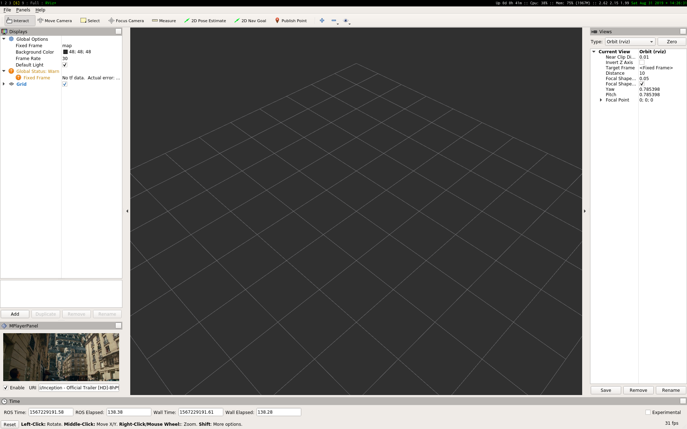

# rviz_mplayer

Rviz panel plugin for embedding mplayer windows.

...because everybody obviously wants to watch their favorite movie while
operating robots.

  

## Usage

Open Rviz, from the menu bar select "Panels" -> "Add New Panel" ->
"MPlayerPanel". Specify the URI of the file you want to play and click enable.

This plugin embeds mplayer inside a panel, so essentially any file that can be
played with mplayer can also be played (e.g. remote files, RTSP stream, etc.)
as long as they don't require additional arguments to be passed to mplayer.

## Credits

- [qmpwidget](https://github.com/jgehring/qmpwidget)

## License

MIT (qmpwidget is distributed under GPL 3)

## Author

Naoki Mizuno (naoki.mizuno.256@gmail.com)
